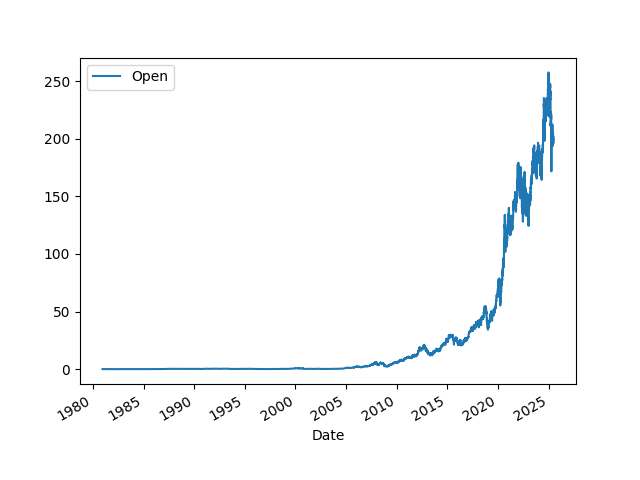
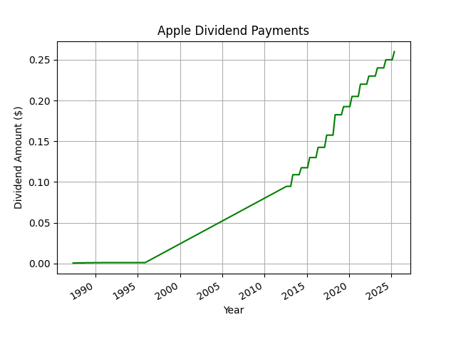
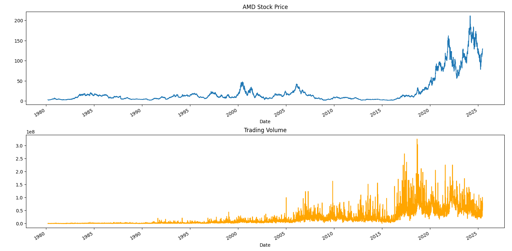

# 📊 IBM Data Science Final Project - Stock Analysis


### A data analysis project developed as part of the IBM Data Science Professional Certificate, focusing on historical stock performance and basic financial metrics using Python.

---

## 📋 Project Overview

This project was developed during the **IBM Data Science Professional Certificate** course. It analyzes historical stock data from companies such as **Apple (AAPL)** and **AMD (Advanced Micro Devices)** using Python and `yfinance`.

The repository includes:

- A full Jupyter Notebook with stock analysis.
- Two standalone Python scripts for separate company insights.
- Saved plot images for visualization.
- Clean code using Pandas and Matplotlib.

---

## 🎯 Objectives

- Load and explore stock data from Yahoo Finance.
- Retrieve company metadata in JSON format.
- Plot stock prices, dividend payments, and trading volume.
- Compare trends over time.

---

## 🧰 Technologies Used

- Python 3.10
- Jupyter Notebook
- pandas
- matplotlib
- yfinance
- requests
- json

---

---

## 📸 Sample Visualizations

## 📈 Stock Analysis Results

### Apple Inc. (AAPL) Performance
<div align="center">
  
  <p>Figure 1: Historical opening price of Apple stocks (1980-2023) showing exponential growth after 2005</p>
</div>

<div align="center">
  
  <p>Figure 2: Apple's dividend payments timeline (1980-2023) demonstrating consistent shareholder returns</p>
</div>

### Advanced Micro Devices (AMD) Analysis
<div align="center">
  
  <p>Figure 3: AMD stock price and trading volume correlation (1980-2023) highlighting market activity spikes</p>
</div>

---

## ▶️ How to Run

1. **Clone the repository:**
   ```bash
   git clone https://github.com/LucasGalvano/IBM-datascience-stock-analysis
   cd IBM-datascience-stock-analysis

2. **Install the required Python libraries using these comands in the terminal:**
   ```bash
   pip install pandas matplotlib yfinance requests

👨‍💻 Author
Lucas Galvano de Paula
Data Science Student | Centro Universitário FEI

📝 License
This project is part of the IBM Data Science Professional Certificate and is intended for educational purposes only.
